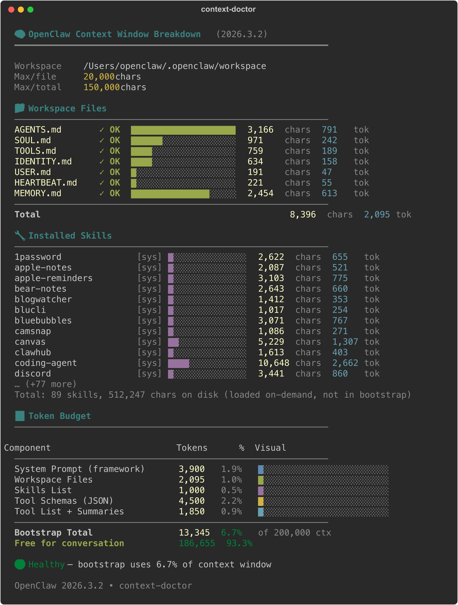

# context-doctor 🧠

Visualize and diagnose your OpenClaw context window usage.

One command to see what's eating your tokens, which files are healthy, and how much room you have left for actual conversation.



## Install

```bash
clawhub install context-doctor
```

Or clone this repo into your workspace skills directory:

```bash
git clone https://github.com/jzOcb/context-doctor.git ~/.openclaw/workspace/skills/context-doctor
```

## Usage

### Terminal (colored output)
```bash
python3 scripts/context-doctor.py
```

### PNG image (for chat / sharing)
```bash
python3 scripts/context-doctor.py --png /tmp/context-doctor.png
```
Requires: `rich` (`pip3 install rich`) + `rsvg-convert` (`brew install librsvg`) or `cairosvg` (`pip3 install cairosvg`)

### JSON (pipe to other tools)
```bash
python3 scripts/context-doctor.py --json
```

### Options
| Flag | Description |
|------|-------------|
| `--workspace PATH` | Custom workspace path (default: auto-detect) |
| `--ctx-size N` | Context window size in tokens (default: 200000) |
| `--png PATH` | Output as PNG image |
| `--json` | Output structured JSON |
| `--no-color` | Disable ANSI colors |

## What it shows

### 📁 Workspace Files
Each bootstrap file with status, character count, and token estimate:
- **✓ OK** — file loaded normally
- **⚠ TRUNCATED** — file exceeds limit, instructions silently cut
- **✗ MISSING** — file not found or broken symlink

### 🔧 Installed Skills
All discovered skills from system, workspace, and global directories.
Skills are loaded on-demand (not in bootstrap), shown for awareness.

### 📊 Token Budget
How your context window is split:
- System Prompt (framework)
- Workspace Files
- Skills List (metadata)
- Tool Schemas + Summaries
- **Free for conversation**

### Health Score
| Signal | Meaning |
|--------|---------|
| 🟢 <10% | Healthy — plenty of room |
| 🟡 10-15% | Moderate — consider trimming |
| 🔴 >15% | Heavy — agent loses context early |

## Agent Integration

When installed as a skill, your OpenClaw agent can automatically run context-doctor when you ask about context window health. With `--png`, the agent generates and sends the visualization directly in chat — no terminal needed.

## License

MIT
